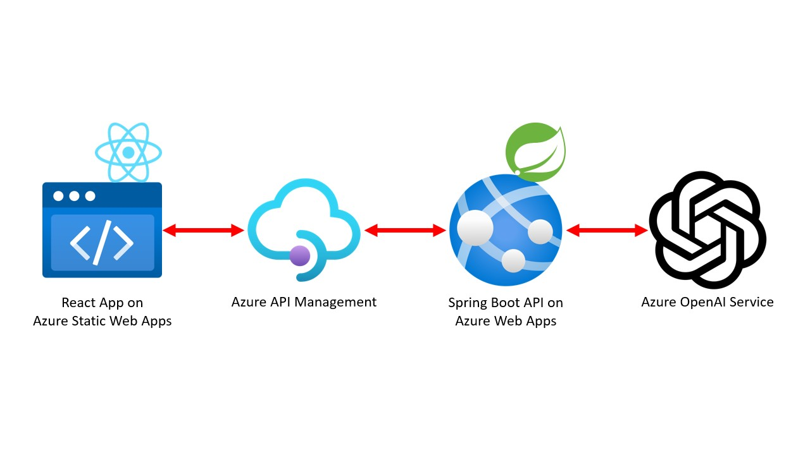
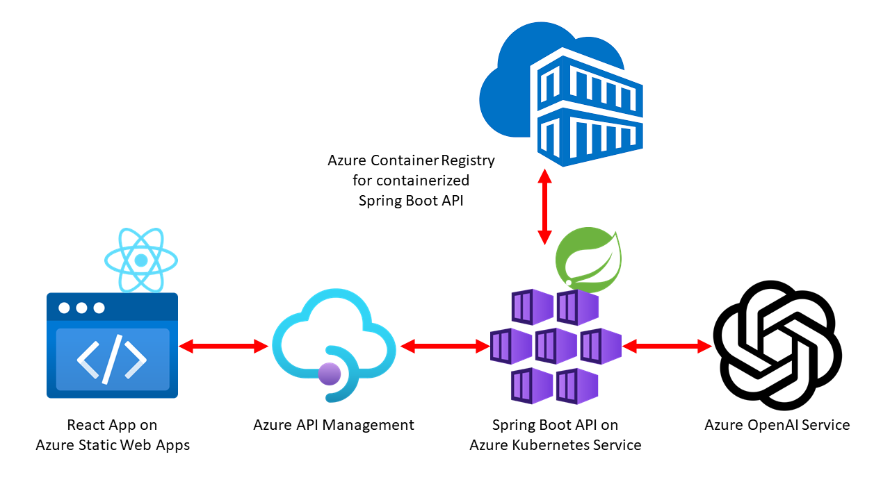
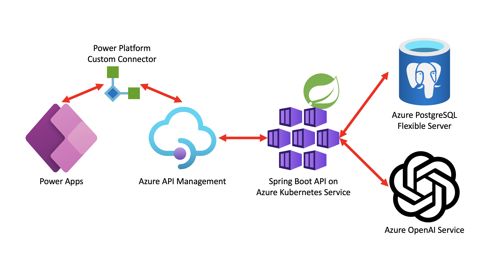

# GitHub Codespaces와 Copilot으로 앱 만들어 보기

Java 기반의 Spring 백엔드와 React 기반의 프론트엔드 앱을 [GitHub Codespaces](https://docs.github.com/ko/codespaces/overview) 안에서 [GitHub Copilot](https://docs.github.com/ko/copilot/quickstart)을 이용해서 빌드하고 애저 및 파워 앱에 배포하는 핸즈온랩입니다.


## 목표

이 핸즈온랩을 끝마치면 여러분은 아래와 같은 내용을 학습할 수 있습니다.

- 인프라스트럭처
  - [GitHub Codespaces](https://docs.github.com/ko/codespaces/overview)
  - [GitHub Copilot](https://docs.github.com/ko/copilot/quickstart)
  - [애저 Bicep](https://learn.microsoft.com/ko-kr/azure/azure-resource-manager/bicep/overview?WT.mc_id=dotnet-93951-juyoo)
  - [애저 Terraform](https://learn.microsoft.com/ko-kr/azure/developer/terraform/overview?WT.mc_id=dotnet-93951-juyoo)
- 프론트엔드 애플리케이션
  - [애저 정적 웹 앱](https://learn.microsoft.com/ko-kr/azure/static-web-apps/overview?WT.mc_id=dotnet-93951-juyoo) &ndash; React 기반
  - [파워 앱](https://learn.microsoft.com/ko-kr/power-apps/powerapps-overview?WT.mc_id=dotnet-93951-juyoo) &ndash; 파워 플랫폼 기반
- 백엔드 애플리케이션
  - [애저 앱서비스](https://learn.microsoft.com/ko-kr/azure/app-service/getting-started?pivots=stack-java&WT.mc_id=dotnet-93951-juyoo) &ndash; Spring 기반
  - [애저 Kubernetes 서비스 (AKS)](https://learn.microsoft.com/ko-kr/azure/aks/intro-kubernetes?WT.mc_id=dotnet-93951-juyoo) &ndash; Spring 기반
  - [애저 PostgreSQL 데이터베이스](https://learn.microsoft.com/ko-kr/azure/postgresql/flexible-server/overview?WT.mc_id=dotnet-93951-juyoo)


## 기본 아키텍처

### 애저 정적 웹 앱 (프론트엔드) + 애저 앱 서비스 (백엔드)




### 애저 정적 웹 앱 (프론트엔드) + 애저 쿠버네티스 서비스 (백엔드) + 애저 컨테이너 레지스트리




### 파워 앱 (프론트엔드) + 애저 쿠버네티스 서비스 (백엔드) + 애저 PostgreSQL (데이터베이스)




## 시작하기

### 사전 준비사항

- [GitHub 계정](https://github.com/signup)
- [GitHub Copilot 구독 (유료; 최초 구독시 30일 무료)](https://github.com/github-copilot/signup)
- [애저 구독 (무료)](https://azure.microsoft.com/ko-kr/free/?WT.mc_id=dotnet-93951-juyoo)


### 퀵스타트 0 &ndash; 코드스페이스 이용

1. 이 리포지토리를 자신의 계정으로 포크합니다.
1. 코드스페이스를 실행시킵니다.
1. `api/src/main/java/roadshow/demo/api/controller/MessageController.java` 파일을 열어 아래 라인의 주석을 해제해서 CORS를 활성화 시킵니다.

    ```java
    // ⬇️⬇️⬇️ Uncomment the line below to enable CORS ⬇️⬇️⬇️
    // @CrossOrigin(origins = ALLOWED_ORIGINS)
    // ⬆️⬆️⬆️ Uncomment the line above to enable CORS ⬆️⬆️⬆️
    @PostMapping
    public MessageResponse sendMessage(@RequestBody MessageRequest request) throws JsonMappingException, JsonProcessingException {
    ```

1. `api/src/main/resources/application-dev.properties` 파일을 생성한 후 아래 내용을 입력합니다. `{{Azure_OpenAI_Service_Endpoint}}` 값과 `{{Azure_OpenAI_Service_API_Key}}` 값은 아래 프로비저닝할 애저 OpenAI 서비스 인스턴스를 참조합니다.

    ```ini
    AOAI_API_ENDPOINT={{Azure_OpenAI_Service_Endpoint}}
    AOAI_API_KEY={{Azure_OpenAI_Service_API_Key}}
    
    CORS_ORIGIN=https://${CODESPACE_NAME}-3000.${GITHUB_CODESPACES_PORT_FORWARDING_DOMAIN}
    ```

1. 새 터미널을 열고 아래 명령어를 순서대로 적용해 백엔드 앱을 실행시킵니다.

   - `mvn` 사용할 경우

     ```bash
     cd api
     mvn spring-boot:run
     ```

   - `mvnw` 사용할 경우

     ```bash
     cd api
     ./mvnw spring-boot:run
     ```

   - 코드스페이스 디버거 사용할 경우

     

1. 새 터미널을 하나 열고 아래 명령어를 순서대로 적용해 프론트엔드 앱을 실행시킵니다.

   ```bash
   cd web
   npm install
   npm run start:codespace
   ```

1. 아래 그림과 같이 3000번 포트와 8080번 포트를 Private 에서 Public으로 바꿉니다.

   

1. 웹 앱에 접속합니다.

   


### 퀵스타트 1 &ndash; 애저 Bicep 이용

1. 이 리포지토리를 자신의 계정으로 포크합니다.
1. 아래 명령어를 차례대로 실행시켜 애저에 리소스를 프로비저닝합니다.

   ```bash
   azd auth login --use-device-code=false
   azd init
   azd up
   azd pipeline config
   ```

   > GitHub 코드스페이스 안에서 `azd auth login --use-device-code=false` 명령어를 사용해서 로그인하는 경우, 최초 404 에러가 날 수 있습니다. 이 때 `azd auth login --use-device-code=false` 명령어를 친 터미널을 종료하지 말고, 주소창의 `http://localhost:...` 링크를 전체 복사합니다. 코드스페이스 안에서 새 터미널을 `zsh`로 연 후 `curl` 명렁어를 통해 실행시키세요.

1. 아래 명령어를 차례로 실행시켜 애플리케이션을 배포합니다.

   ```bash
   gh auth login

   gh workflow run "Azure Dev" --repo $GITHUB_REPOSITORY
   ```

   > 만약 `gh auth login` 명령어를 실행시키는 도중 에러가 발생하면 `GITHUB_TOKEN=` 명령어를 실행시켜 토큰을 초기화한 후 다시 실행시킵니다.

1. 배포가 끝난 후 애저 포털에서 애저 정적 웹 앱 인스턴스를 찾아 실행시켜 제대로 배포가 되었는지 확인합니다.

1. 실행이 다 끝났다면 아래 명령어를 통해 리소스를 삭제합니다.

    ```bash
    # 리소스 삭제
    azd down --force

    # APIM 완전 삭제
    pwsh ./infra/Purge-ApiManagement.ps1

    # Cognitive 서비스 완전 삭제
    pwsh ./infra/Purge-CognitiveService.ps1
    ```

### 퀵스타트 2 &ndash; 애저 Terraform 이용

본 과정은 이전 퀵스타트 1에서 적어도 `azd up` 까지를 완료하였다고 가정하고 진행합니다.
따라서 포크한 저장소를 그대로 사용합니다.

1. Terraform - IaC 코드 구현: AKS & ACR

[Session02 Code - Sheet](workshop/session02.md)를 참고하여 Terraform 코드를 잘 정의합니다.

1. 다음 과정을 통해 정의한 인프라에 대해 Terraform 배포를 할 수가 있습니다.

  - Terraform 상태 관리를 위해 필요한 내용들을 환경 변수로 가져옵니다.
    [state.azcli](https://github.com/Azure-Samples/gh-codespaces-copilot-in-a-day-ko/blob/session02-infra/terraform/state/state.azcli) 내용을 실행합니다.
  - `saName` 값을 `terraform/infra-k8s/main.tf` 내 `storage_account_name` 값으로 변경 적용을 합니다.
  - Terraform 초기화, 실행 계획 만들기 및 실행 계획 적용을 합니다.
    ```bash
    cd terraform/infra-k8s

    # Terraform 초기화
    terraform init -upgrade

    # Terraform 실행 계획 만들기
    terraform plan -out main.tfplan

    # Terraform 실행 계획 적용
    terraform apply main.tfplan
    ```
1. Spring Boot API: 컨테이너화를 위한 코드 추가

  - [Session02 Code - Sheet](workshop/session02.md)을 통해 컨테이너화를 위한 Dockerfile 및 pom.xml을 참고합니다.
  - 이 때, `application-dev.properties` 파일에 AOAI_API_ENDPOINT와 AOAI_API_KEY 설정을 추가로 해야 함을 잊지 마세요.

1. Sprint Boot API: 컨테이너화 & ACR 업로드
    ```bash
    cd api

    # 컨테이너화할 jar 파일 생성
    mvn clean package spring-boot:repackage

    # 위 생성한 jar 파일에 대한 컨테이너 패키징 & ACR 업로드
    mvn package -PbuildAcr -DskipTests -DRESOURCE_GROUP=${RESOURCE_GROUP} -DACR_NAME=${ACR_NAME}
    ```

1. AKS 환경에 서비스로 올리기
    ```bash
    # AKS 설정을 가져오기
    az aks get-credentials --resource-group=${RESOURCE_GROUP} --name=${AKS_NAME}

    # AKS에 올리고 8080 포트를 노출
    kubectl run api --image=${ACR_URI}/api:0.0.1-SNAPSHOT
    kubectl expose pod api --type=LoadBalancer --port=8080 --target-port=8080

    # 잠시 뒤 IP 주소 확인
    kubectl get services -o=jsonpath='{.items[*].status.loadBalancer.ingress[0].ip}'
    ```
1. APIM 설정 변경을 통한 최종 확인

1. 실행이 다 끝났다면 아래 명령어를 통해 리소스를 삭제합니다.
    ```bash
    # AKS에 등록한 Services 및 Pod 제거
    kubectl delete services api
    kubectl delete pod api

    # 리소스 제거를 위한 Terraform 실행 계획 만들기
    terraform plan -destroy -out main.destroy.tfplan

    # Terraform 리소스 제거 실행 계획 적용
    terraform apply main.destroy.tfplan
    ```

### 퀵스타트 3 &ndash; 파워 앱 이용

TBD


## 참고 자료 및 추가 학습 자료

TBD
