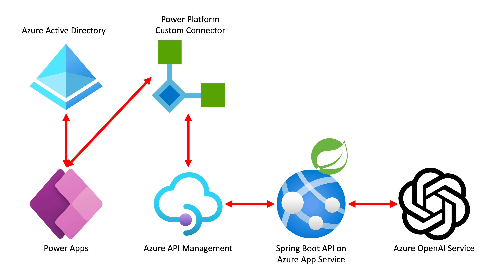

# GitHub Codespaces와 Copilot으로 앱 만들어 보기

Java 기반의 Spring 백엔드와 React 기반의 프론트엔드 앱을 [GitHub Codespaces](https://docs.github.com/ko/codespaces/overview) 안에서 [GitHub Copilot](https://docs.github.com/ko/copilot/quickstart)을 이용해서 빌드하고 애저 및 파워 앱에 배포하는 핸즈온랩입니다.


## 목표

이 핸즈온랩을 끝마치면 여러분은 아래와 같은 내용을 학습할 수 있습니다.

- 인프라스트럭처
  - [GitHub Codespaces](https://docs.github.com/ko/codespaces/overview)
  - [GitHub Copilot](https://docs.github.com/ko/copilot/quickstart)
  - [애저 Bicep](https://learn.microsoft.com/ko-kr/azure/azure-resource-manager/bicep/overview?WT.mc_id=dotnet-93951-juyoo)
  - [애저 Terraform](https://learn.microsoft.com/ko-kr/azure/developer/terraform/overview?WT.mc_id=dotnet-93951-juyoo)
- 프론트엔드 애플리케이션
  - [애저 정적 웹 앱](https://learn.microsoft.com/ko-kr/azure/static-web-apps/overview?WT.mc_id=dotnet-93951-juyoo) &ndash; React 기반
  - [파워 앱](https://learn.microsoft.com/ko-kr/power-apps/powerapps-overview?WT.mc_id=dotnet-93951-juyoo) &ndash; 파워 플랫폼 기반
- 백엔드 애플리케이션
  - [애저 앱서비스](https://learn.microsoft.com/ko-kr/azure/app-service/getting-started?pivots=stack-java&WT.mc_id=dotnet-93951-juyoo) &ndash; Spring 기반
  - [애저 Kubernetes 서비스 (AKS)](https://learn.microsoft.com/ko-kr/azure/aks/intro-kubernetes?WT.mc_id=dotnet-93951-juyoo) &ndash; Spring 기반
  - [애저 PostgreSQL 데이터베이스](https://learn.microsoft.com/ko-kr/azure/postgresql/flexible-server/overview?WT.mc_id=dotnet-93951-juyoo)


## 기본 아키텍처

### 애저 정적 웹 앱 (프론트엔드) + 애저 앱 서비스 (백엔드)


### 애저 정적 웹 앱 (프론트엔드) + 애저 쿠버네티스 서비스 (백엔드) + 애저 PostgreSQL (데이터베이스)


### 파워 앱 (프론트엔드) + 애저 쿠버네티스 서비스 (백엔드) + 애저 PostgreSQL (데이터베이스)




## 시작하기

### 앱 로컬 실행

1. `web/App.js` 의 로컬 실행 주석 해제, Azure 실행 주석 처리

   ```javascript
   //Send the message to the backend api
   //Uncomment this & comment fetch("/api/messages") if you want to run in local.
   fetch("http://localhost:8080/api/messages", {
   //fetch("/api/messages", {
   method: "POST",
   headers: { "Content-Type": "application/json" },
   body: JSON.stringify({ text: msgText }),
   })
   ```
2. `api/src/main/java/roadshow/demo/api/controller/MessageController.java` 의 로컬 실행 주석 해제, Azure 실행 주석 처리

   ```java
   //Uncomment below import if you want to run in local.
   import org.springframework.beans.factory.annotation.Value;

   ...

   import org.springframework.web.bind.annotation.CrossOrigin;

   ...

   //Uncomment this & line 13 if you want to run this app with react frontend in local.
   @CrossOrigin(origins = "http://localhost:3000")
   @RestController
   @RequestMapping("/api/messages")
   public class MessageController {

       //uncomment this if you want to run this app in local.
       //Get env var(aoaiurl, aoaikey) from application.properties
       @Value("${aoaiurl}")
       private String aoaiUrl;

       @Value("${aoaikey}")
       private String aoaiApiToken;

       //comment this two lines if you want to run this app in local.
       //private String aoaiUrl = System.getenv("AOAI__API_Endpoint") + "openai/deployments/model-gpt35turbo/chat/completions?api-version=2023-03-15-preview";
       //private String aoaiApiToken = System.getenv("AOAI__API_Key");
   ```

3. `api/src/main/resources/application.properties` 에 본인이 생성한 Azure OpenAI Endpoint와 API Key 값 삽입

    ```
    # Uncomment and fill in the following lines to use the AOAI API in local development
    aoaiurl=<YOUR AOAI ENDPOINT>
    aoaikey=<YOUR AOAI API KEY>
    ```

4. 프론트엔드 (React 앱) 빌드

    ```bash
    cd web
    npm install
    npm start
    ```

5. 백엔드 (Spring Boot 앱) 빌드

   - `mvn` 사용시

        ```bash
        cd api
        mvn spring-boot:run
        ```

   - `mvnw` 사용시

        ```bash
        cd api
        ./mvnw spring-boot:run
        ```

   - 디버거 사용시

   

6. 웹 앱 접속

   


### 사전 준비사항

- [GitHub 계정](https://github.com/signup)
- [GitHub Copilot 구독 (유료; 최초 구독시 30일 무료)](https://github.com/github-copilot/signup)
- [애저 구독 (무료)](https://azure.microsoft.com/ko-kr/free/?WT.mc_id=dotnet-93951-juyoo)


### 설치 및 배포

TBD


### 퀵스타트 1 &ndash; 애저 Bicep 이용

1. 이 리포지토리를 자신의 계정으로 포크합니다.
2. 아래 명령어를 차례대로 실행시켜 애저에 리소스를 프로비저닝합니다.

    ```bash
    azd auth login --use-device-code=false
    azd init
    azd pipeline config
    azd up
    ```

   > GitHub 코드스페이스 안에서 `azd auth login --use-device-code=false` 명령어를 사용해서 로그인하는 경우, 최초 404 에러가 날 수 있습니다. 이 때 주소창의 `http://localhost:...` 부분을 복사해서 코드스페이스 안에서 새 터미널을 연 후 `curl` 명렁어를 통해 실행시키세요.
3. 아래 명령어를 차례로 실행시켜 애플리케이션을 배포합니다.

    ```bash
    gh auth login

    gh workflow run scenario01-build-deploy.yml --repo $GITHUB_REPOSITORY
    ```

   > 만약 `gh auth login` 명령어를 실행시키는 도중 에러가 발생하면 `GITHUB_TOKEN=` 명령어를 실행히켜 토큰을 초기화한 후 다시 실행시킵니다.


### 퀵스타트 2 &ndash; 애저 Terraform 이용

TBD


### 퀵스타트 3 &ndash; 파워 앱 이용

TBD


## 참고 자료 및 추가 학습 자료

TBD
