# Session01 Code Sheet

첫 번째 세션에서 copilot으로 생성해야 할 코드 가이드라인/예시를 소개합니다. 라이브로 따라하지 못해도 해당 sheet 페이지를 통해 본인의 copilot 결과와 비교하며 앱을 테스트하고 배포할 수 있습니다.

## 인프라 프로비저닝 - `infra` 폴더

### 1. `appservicePlan.bicep`

* `asplan` 리소스 정의
  ```
    // Define serverfarms resource named 'asplan'
    // with hosting plan variables, sku, properties
  ```

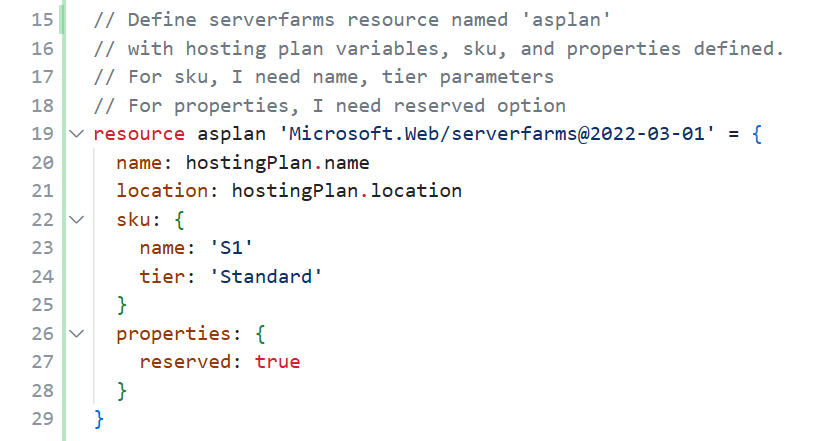

> `serverfarms` 버전을 확인합니다.
> 
> sku의 `name`, `tier`를 확인합니다.

* `output` 정의
  ```
    // Output id and name from asplan resource
  ```
  
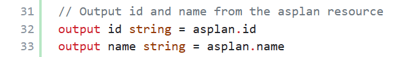


### 2. `provision-appService.bicep`

* `appServicePlan` 모듈 정의
  ```
    // add app service plan module
  ```

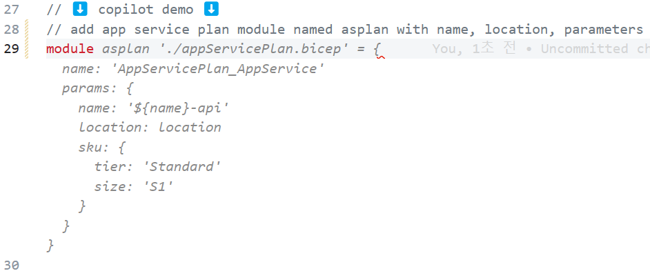

### 3. `openAI.bicep`

<!-- * `aoai` 리소스 정의

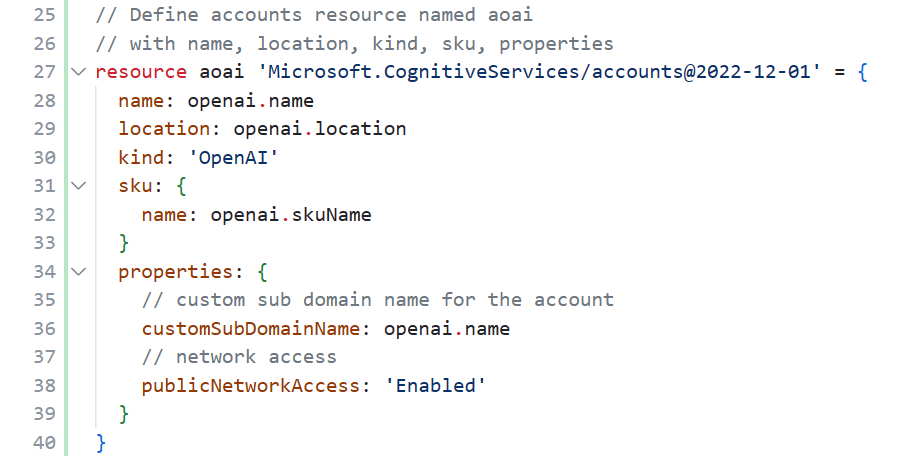

> `accounts` 버전을 확인합니다. -->

* `openaiDeployment` 리소스 정의
  ```
    //Define deployments resource named 'openaiDeployment'
    //with name, properties(model, scaleSettings)

    //model with format, name, version
  ```

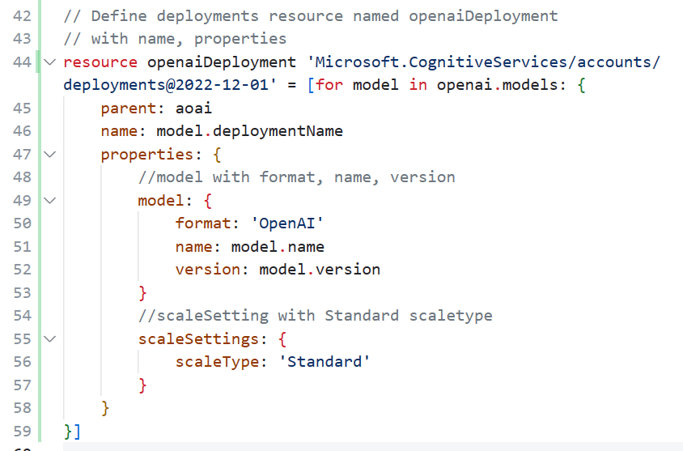

> `properties` 사이에 주석을 추가해서 `model` 과 `scaleSettings` 파라미터를 추가합니다.

### 4. `provision-cognitiveServices.bicep`

* `aoai` 모듈 정의
  ```
    // Add openAI bicep as a module named aoai
  ```

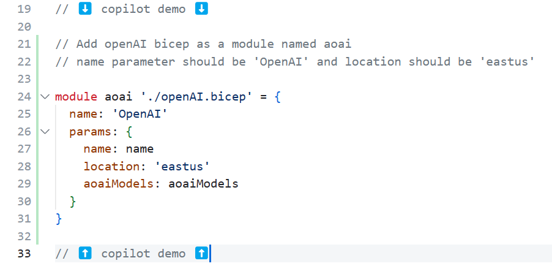

* `output` 정의
  ```
    // output for aoai API key, endpoint, version, deploymentID

    // Get apiVersion & apiDeploymentName from aoaiModels array[0]
  ```

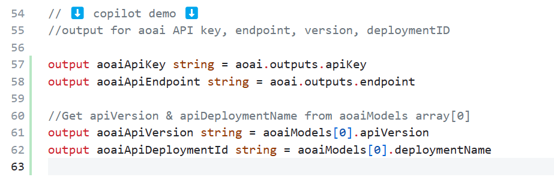

## 프론트 엔드 - `web` 폴더

### 1. 헤더 추가

return 상단에 원하는 헤더 내용을 담아 `msger head title` 을 추가합니다.

``` javascript
// Add msger head title with title name: askmeazure.openai
```

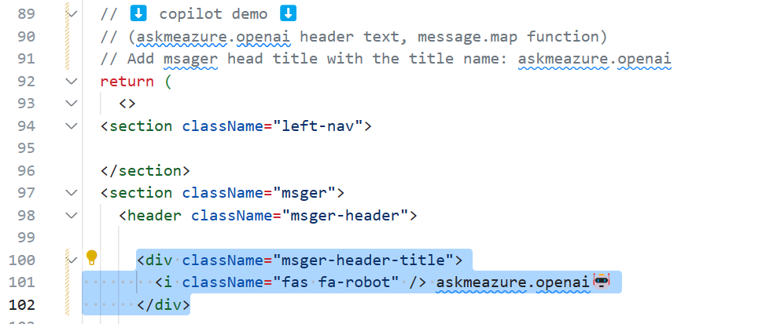

### 2. `const[messages, setMessages] = useState([])` 추가

`messages` 를 정의하고, appendMessage 함수를 통해 azure bot의 인사말을 추가합니다.

``` javascript
//Define messages const to set the first message from azure bot
//Call appendMessage function to render the first message from the azure bot
```

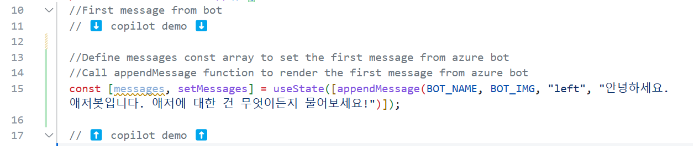

> 인사말 결과

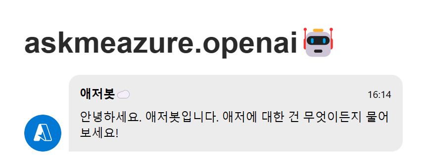

### 3. `form` 데이터에서 message 가져오기

```javascript
//Get target value and define it as form.
//Define msgerInput as a FormData
//Get the value from msger-input element
```

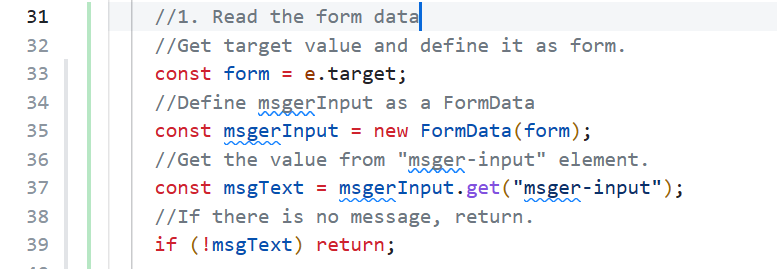

### 4. `appendMessage`로 질문과 로딩 답변 추가하기

* Enter와 함께 input을 비워줍니다.
* `setMessage` 함수를 통해 입력 받은 질문과 로딩 답변을 추가합니다.

```javascript
//Make the input empty
//get msger-input element from form and make it empty

//Append the input message to the chat
//Use setMessages function to append the message

//Append the loading message
```

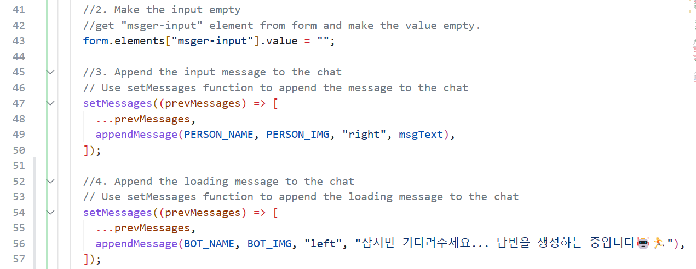

### 5. `map`으로 `messages` 리턴하기

return 상단에 `messages.map` 함수의 형태/결과 등을 정의합니다.

```javascript
// Add message.map function to render messages.
// Each message should be React.Fragment
```

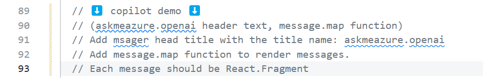

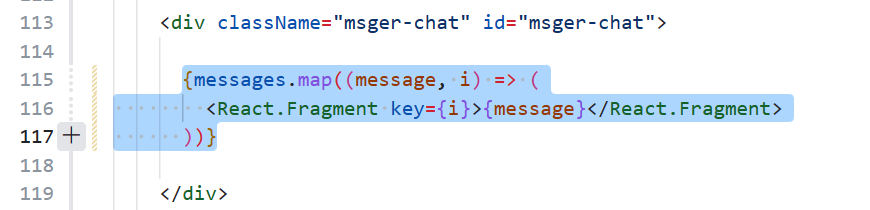

## 백엔드 - `api` 폴더

<!-- ### 1. `OpenAPI` 구성

* `OpenAPI` object 생성
* `Contact` object 생성
* `License` object 생성
* `Info` object 생성

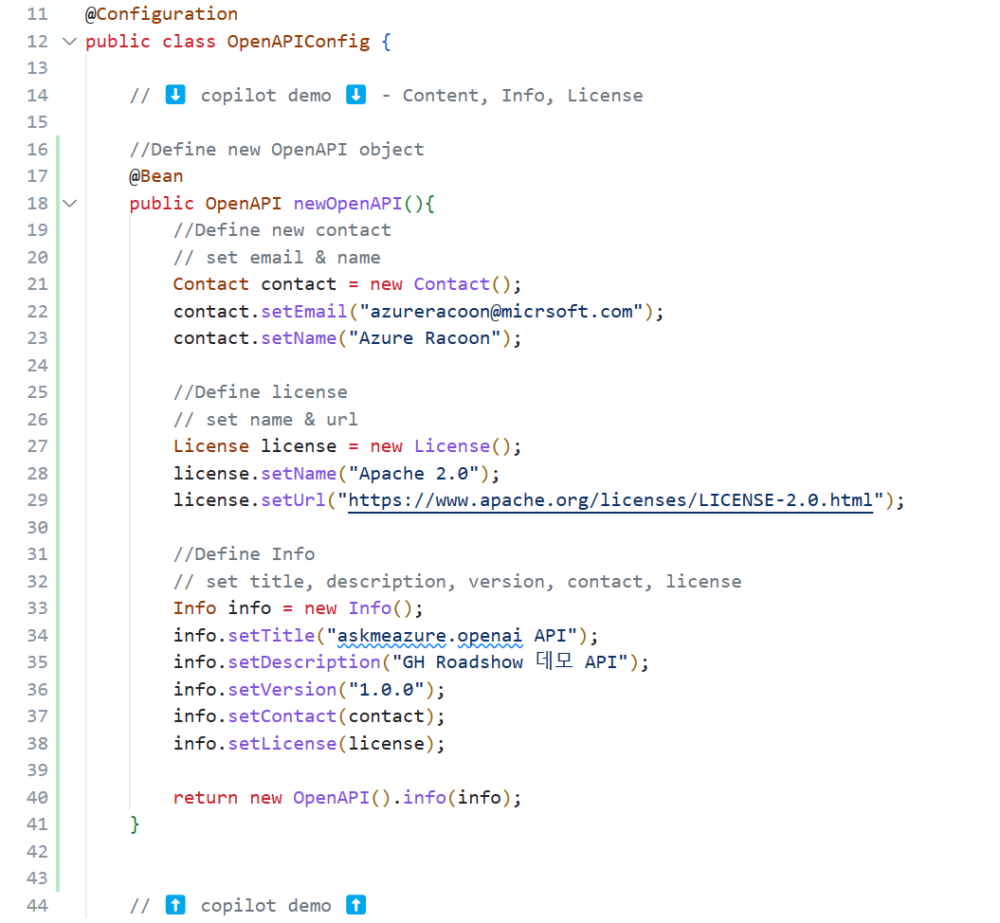 -->

### 1. POST `/api/messages` 구성

<!-- * `request` json에서 text 가져오기
* `String preMsg` 주석 해제
* `HTTPHeaders` 정의
* `api-key` 정의
  
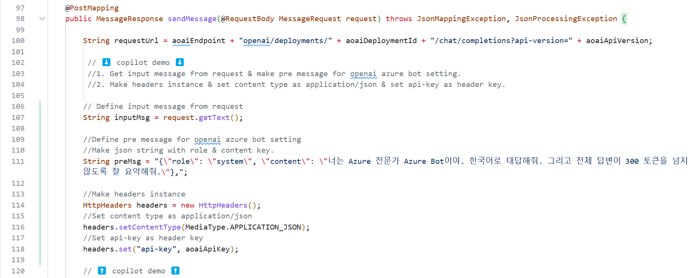

* `body` `headers` 로 `HTTPEntity` 정의
* `RestTemplate` 정의

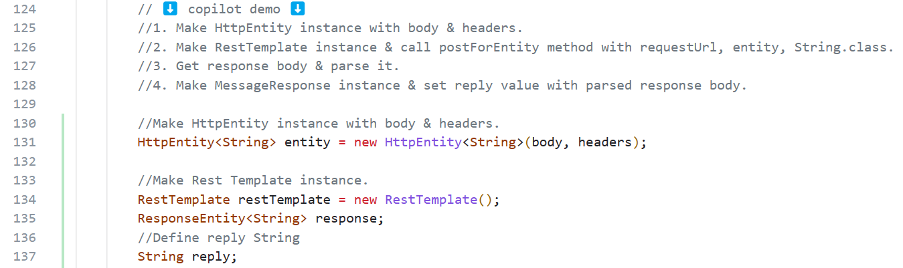 -->

* `try` `catch` 문으로 Azure OpenAI API 호출

  ```java
  //Make try catch block for handling exception.
  //Make ResponseEntity instance & call postForEntity method with requestUrl, entity, String.class
  ```

* `response` json에서 `content` 가져오기
    ```java
    //Define jsonBody as response body
    //parse jsonBody
    //Define JsonNode instance & call readTree
    //Initialize reply value
    ```
* Error message 정의
  ```java
    //Print exception with System.out.println
    //Set reply value with error message.
  ```

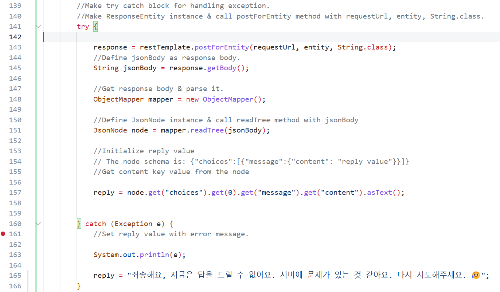

* `return` 문으로 `response` 리턴
```java
    //Make MessageResponse instance & set reply value
```

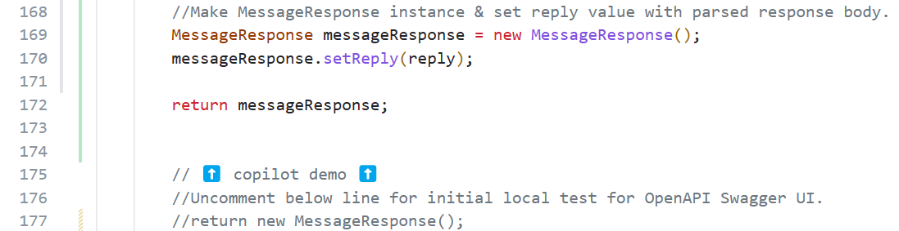

## 배포 시 주의 사항
1. `application.properties` 12번째 줄 주석 처리
```
    #CORS_ORIGIN=https://${CODESPACE_NAME}-3000.${GITHUB_CODESPACES_PORT_FORWARDING_DOMAIN}
```
> CODESPACE_NAME과 같은 환경 변수가 GH Action 인스턴스에는 없기 때문에 빌드 시 에러가 발생하므로 반드시 주석처리

2. `application.properties` 13번째 줄 주석 해제
```
    CORS_ORIGIN=http://localhost:3000
```
