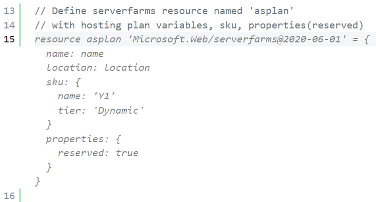
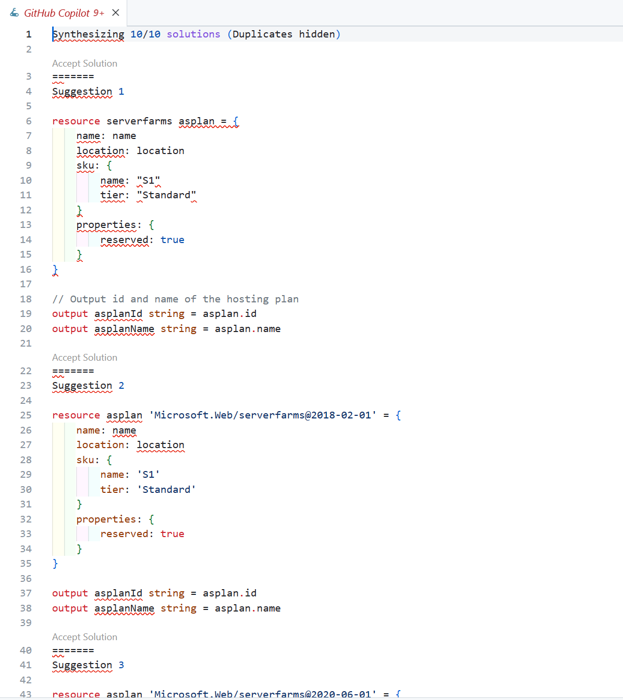
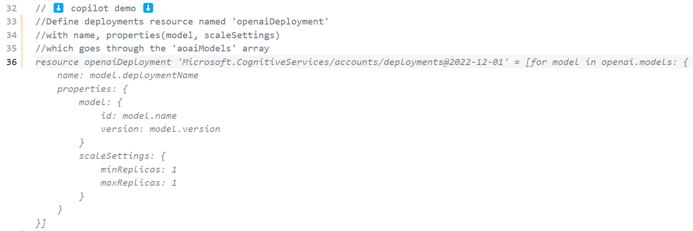

# Session01 Code Sheet

첫 번째 세션에서 copilot으로 생성해야 할 코드 가이드라인/예시를 소개합니다. 해당 sheet 페이지를 통해 본인의 copilot 결과와 비교하며 앱을 테스트하고 배포할 수 있습니다.

## 인프라 프로비저닝 - `infra` 폴더

### 1. `appservicePlan.bicep`

* `asplan` 리소스 정의
    **copilot 명령 주석**

  ```bicep
    // Define serverfarms resource named 'asplan'
    // with hosting plan variables, sku, properties
  ```

  

  Github Copilot이 제안해주는 자동 완성을 수락하여 바로 사용할 수도 있고, 단축키 `ctrl + Enter` 로 최대 10개의 추천을 확인하고 그 중 하나를 수락할 수 있습니다.

  

  이때 resource의 버전이나 자동 생성 된 sku 값들이 정확하지 않기 때문에 Answer sheet를 참고하여 변수들을 업데이트합니다.

  > Answer sheet
  >
  > ```bicep
  >resource asplan 'Microsoft.Web/serverfarms@2022-03-01' = {
  >  name: hostingPlan.name
  >  location: hostingPlan.location
  >  kind: 'linux'
  >  sku: {
  >    name: 'S1'
  >    tier: 'Standard'
  >  }
  >  properties: {
  >    reserved: true
  >  }
  >}
  > ```

* `output` 정의
  **copilot 명령 주석**

  ```bicep
    // Output id and name from asplan resource
  ```

  > Answer sheet
  >
  > ```bicep
  >output id string = asplan.id
  >output name string = asplan.name
  > ```
  >

### 2. `provision-appService.bicep`

* `appServicePlan` 모듈 정의
  **copilot 명령 주석**

  ```bicep
    // add app service plan module named asplan with name, location, parameters
  ```

  

  > Answer sheet
  > ```bicep
  >module asplan './appServicePlan.bicep' = {
  >  name: 'AppServicePlan_AppService'
  >  params: {
  >    name: '${name}-api'
  >    location: location
  >  }
  >}
  > ```

### 3. `openAI.bicep`

* `openaiDeployment` 리소스 정의

  ```bicep
    //Define deployments resource named 'openaiDeployment'
    //with name, properties(model, scaleSettings)
    //which goes through the 'aoaiModels' array

    //model with format, name, version
  ```

    

  > `properties` 사이에 주석을 추가해서 `model` 과 `scaleSettings` 파라미터를 추가합니다.

  > Answer sheet
  > ```bicep
  >resource openaiDeployment 'Microsoft.CognitiveServices/accounts/deployments@2022-12-01' = [for model in openai.models: {
  >  name: '${aoai.name}/${model.deploymentName}'
  >  properties: {
  >    model: {
  >      format: 'OpenAI'
  >      name: model.name
  >      version: model.version
  >    }
  >    scaleSettings: {
  >      scaleType: 'Standard'
  >    }
  >  }
  >}]
  >```

### 4. `provision-cognitiveServices.bicep`

* `aoai` 모듈 정의

  ```bicep
    // Add openAI bicep as a module named aoai
  ```

    위와 비슷한 내용이므로 스크린샷 생략.

    > Answer sheet
    >```bicep
    > module aoai './openAI.bicep' = {
    >  name: 'OpenAI'
    >  params: {
    >    name: name
    >    location: 'eastus'
    >    aoaiModels: aoaiModels
    >  }
    >}
    >```

* `output` 정의

  ```bicep
    // output for aoai API key, endpoint, version, deploymentID

    // Get apiVersion & apiDeploymentName from aoaiModels array[0]
  ```
    
    마찬가지 이유로 스크린샷 생략.

    > Answer sheet
    > ```bicep
    >output aoaiApiKey string = aoai.outputs.apiKey
    >output aoaiApiEndpoint string = aoai.outputs.endpoint
    >output aoaiApiVersion string = aoaiModels[0].apiVersion
    >output aoaiApiDeploymentId string = aoaiModels[0].deploymentName
    >```

## 프론트 엔드 - `web/src/App.js`

### 1. 헤더 추가

**57번째 줄** return 상단에 원하는 헤더 내용을 담아 `msger head title` 을 추가합니다.

``` javascript
// Add msger head title with title name: askmeazure.openai
```


> Answer sheet
>
> ```javascript
> <div className="msger-header-title">
>        <i className="fas fa-comment-alt" /> askmeazure.openai🤖
> </div>
> ```
### 2. `const[messages, setMessages] = useState([])` 추가

`messages` 를 정의하고, appendMessage 함수를 통해 azure bot의 인사말을 추가합니다.

``` javascript
// Define messages const to set the first message from azure bot
// Call appendMessage function to render the first message from the azure bot
```


> 인사말 결과


> Answer sheet
> ```javascript
>  const [messages, setMessages] = useState([appendMessage(BOT_NAME, BOT_IMG, "left", "안녕하세요, 애저봇입니다. 만나서 반가워요! 오늘은 뭘 도와드릴까요?")]);
> ```

### 3. `form` 데이터에서 message 가져오기

```javascript
// Get target value and define it as form.
// Define msgerInput as a FormData
// Get the value from msger-input element
//If there is no message, return
```


> Answer sheet
> ```javascript
> const form = e.target;
> const msgerInput = new FormData(form);
> const msgText = msgerInput.get("msger-input");
> if (!msgText) return; 
> ```

### 4. `appendMessage`로 질문과 로딩 답변 추가하기

* Enter와 함께 input을 비워줍니다.
* `setMessage` 함수를 통해 입력 받은 질문과 로딩 답변을 추가합니다.

```javascript
//Make the input empty
//get msger-input element from form and make it empty

//Append the input message to the chat
//Use setMessages function to append the message

//Append the loading message
```


> Answer sheet
> 

### 5. `map`으로 `messages` 리턴하기

1번에서 헤더를 추가하기 위해 주석을 추가 했던 곳으로 돌아가서  `messages.map` 함수의 형태/결과 등을 정의합니다.

```javascript
// Add message.map function to render messages.
// Each message should be React.Fragment
```


> Answer sheet
> ```javascript
> {messages.map((message, index) => (
>    <React.Fragment key={index}>
>       {message}
>    </React.Fragment>
> ))}
> ```

## 백엔드
* 파일 위치: `api/src/main/java/roadshow/demo/api/controller/Message.Controller`

<!-- ### 1. `OpenAPI` 구성

* `OpenAPI` object 생성
* `Contact` object 생성
* `License` object 생성
* `Info` object 생성

 -->

### 1. POST `/api/messages` 구성

<!-- * `request` json에서 text 가져오기
* `String preMsg` 주석 해제
* `HTTPHeaders` 정의
* `api-key` 정의
  


* `body` `headers` 로 `HTTPEntity` 정의
* `RestTemplate` 정의

 -->

* `try` `catch` 문으로 Azure OpenAI API 호출
* `response` json에서 `content` 가져오기

    ```java
    // Make try catch for restTemplate.postForEntity method.
    // Define jsonBody as response body
    // parse jsonBody
    // Define JsonNode instance & call readTree
    // Initialize reply value
    ```

    

* Error message 정의

  ```java
  // Print exception with System.out.println
  // Set reply value with error message.
  ```

* `return` 문으로 `response` 리턴

  ```java
  //Make MessageResponse instance & set reply value
  ```

> Answer sheet
> ```java
> try {
>     response = restTemplate.postForEntity(requestUrl, entity, String.class);
>     String jsonResponse = response.getBody();
>
>     // Parse the JSON string using Jackson
>     ObjectMapper objectMapper = new ObjectMapper();
>     JsonNode rootNode = objectMapper.readTree(jsonResponse);
>     reply = rootNode.get("choices").get(0).get("message").get("content").asText();
>
> } catch(Exception e) {
>     System.out.println("Exception: " + e);
>     reply = "죄송해요, 지금은 답을 드릴 수 없어요. 서버에 문제가 있는 것 같아요. 다시 시도해주세요. 😥";
> }
>   
> MessageResponse messageResponse = new MessageResponse();
> messageResponse.setReply(reply);
> return messageResponse;
> ```

## 배포 시 주의 사항

1. `application.properties` 12번째 줄 주석 처리

```
    #CORS_ORIGIN=https://${CODESPACE_NAME}-3000.${GITHUB_CODESPACES_PORT_FORWARDING_DOMAIN}
```

> CODESPACE_NAME과 같은 환경 변수가 GH Action 인스턴스에는 없기 때문에 빌드 시 에러가 발생하므로 반드시 주석처리

2. `application.properties` 13번째 줄 주석 해제

```
    CORS_ORIGIN=http://localhost:3000
```
