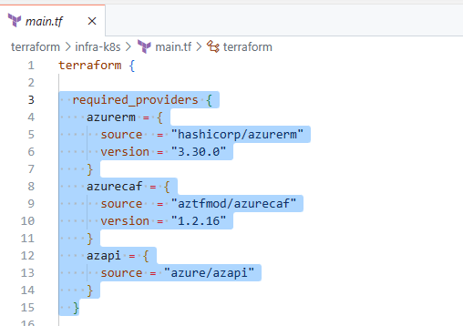
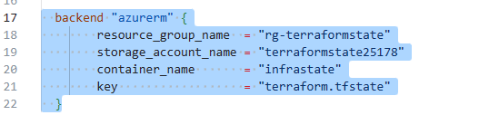
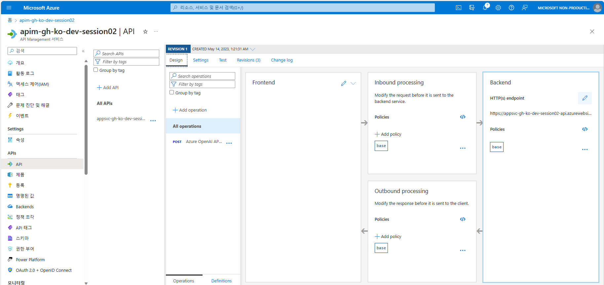

# Session02 Code - Sheet

두 번째 세션에서 GitHub Copilot & Codespaces로 생성해야 할 코드 가이드라인/예시를 소개합니다.
라이브로 따라하지 못해도 해당 sheet 페이지를 통해 본인의 Copilot 결과와 비교하며 앱을 테스트하고 배포할 수 있습니다.

## Terraform 인프라: 프로비저닝

정답지 Sheet는 원 저장소 [session02-infra] 브랜치 내 terraform 폴더에 있습니다.
- https://github.com/Azure-Samples/gh-codespaces-copilot-in-a-day-ko/tree/session02-infra/terraform

### 1. `infra-k8s/main.tf`

* `required_providers` 정의: `azurerm`, `azurecaf`, `azapi` 3개의 provider를 필요로 함

> 버전은 `azurerm`은 `3.30.0`, `azurecaf`는 `1.2.16`와 같이 수동으로 맞출 수밖에 없음

* `backend` 정의

> `storage_account_name` 는 Azure에서 만든 결과를 사용합니다.

### 2. `infra-k8s/outputs.tf`

* 결과 대상: `resource_group`, `acr_name`, `cluster_name`, `cluster_fqdn`, `client_certificate`, `client_key`, `cluster_ca_certificate`, `kube_config`, `kube_config_raw`, `username`, `password`, `kubelet_identity`, `acr_fqdn`, `acr_admin_username`, `acr_admin_password`

* 중요 정보는 반드시 `sensitive = True` 를 설정해야 함

* 2개 모듈 정의 후 실제 value를 설정하는 것이 좋겠다.

### 3. `infra-k8s/variables.tf`

* 변수: `application_name`, `environment`, `location`, `acr_id`, `dns_prefix`

* `variable "변수명" {` 정도 입력하면 Copilot 제안이 나옴

### 4. 모듈 정의: `modules/acr`

* `main.tf`
  * required_providers: `azurecaf`
  * `resource "azurecaf_name" "acr"` with `suffixes` as `[var.environment]`
  * `resource "azurerm_container_registry" "acr"` - "sku" as `Standard`

* `outputs.tf`
  * `acr_id`, `registry_name`, `acr_fqdn`, `admin_username`, `admin_username`

* `variables.tf`
  * `resource_group`, `application_name`, `environment`, `location`

### 5. 모듈 정의: `modules/aks`

* `main.tf`
  * required_providers: `azurecaf`
  * `resource "azurecaf_name" "aks_cluster"` with `suffixes` as `[var.environment]`
  * `resource "azurerm_kubernetes_cluster" "aks"` - "default_node_pool"'s `vmsize` as `Standard_D2_v2` and "identity" as `SystemAssigned`
  * `resource "azurerm_role_assignment" "acrpull_role"` - "scope" as `var.acr_id`, "role_definition_name" as `"AcrPull"`, "principal_id" as `azurerm_kubernetes_cluster.aks.kubelet_identity.0.object_id` <- Type as comment like "grant permission to aks to pull images from acr"

* `outputs.tf`
  * `cluster_name`, `cluster_fqdn`, `kube_config`, `kube_config_raw`

* `variables.tf`
  * `agent_count` as default 3, `resource_group`, `application_name`, `environment`, `location`, `acr_id`, `dns_prefix`

## Sprint Boot API: 컨테이너화를 위한 코드

### 1. pom.xml: https://github.com/Azure-Samples/gh-codespaces-copilot-in-a-day-ko/blob/session02-containerize/api/pom.xml

- 질문 예제 (Copilot Chat, Preview)
  - `자바 스프링 부트 앱을 컨테이너화하려고 하는데, pom.xml 변경 사항을 추천해줘. <profiles> 파트야.`
  - `pom.xml 을 통해 Azure Container Registry에 업로드하는 방법을 알려줘`

### 2. Dockerfile: https://github.com/Azure-Samples/gh-codespaces-copilot-in-a-day-ko/blob/session02-containerize/api/Dockerfile

- 질문 예제 (Copilot Chat, Preview)
  - `Spring Boot앱을 컨테이너화할 때 Dockerfile 예제가 필요해.`

- Java 버전을 17로 맞출 것. 그 외 노출 포트 번호 (8080) 등은 직접 확인이 필요함.

## 그 외 참고를 위한 시트

### Azure API Management 설정 변경 화면

* Thank you

